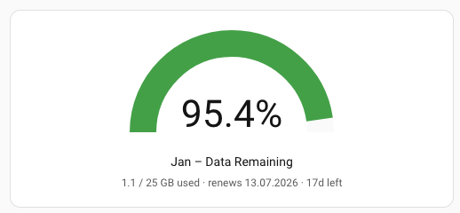

# Aldi Talk Card

A compact Lovelace card for [Aldi Talk](https://www.alditalk.de/) prepaid lines in Home Assistant.
It shows a gauge of the **remaining data percentage** (green / amber / red) plus a caption with
**used / total GB**, the **renewal date**, and **days left** — derived from a single entity prefix.



## Requirements

- The [homeassistant-AldiTalk](https://github.com/JonasJoKuJonas/homeassistant-AldiTalk) custom
  integration (HA domain `aldi_talk`), or any integration that creates the sensors below.
  For each line it must provide:
  - `<base>_remaining_data_percentage`
  - `<base>_total_data_volume`
  - `<base>_remaining_data_volume`
  - `<base>_end_date`

No other custom cards are required — this card is **self-contained** (it uses Home Assistant's
built-in gauge card and does its own styling). In particular it does **not** require `card-mod`.

## Installation

### HACS (recommended)

1. HACS → **⋮** → **Custom repositories**.
2. Add `https://github.com/jvilhuber/lovelace-aldi-talk-card`, category **Dashboard**.
3. Install **Aldi Talk Card**. HACS registers the resource automatically.
4. Hard-refresh your browser (Ctrl/Cmd + Shift + R).

### Manual

1. Copy `aldi-talk-card.js` to `<config>/www/`.
2. **Settings → Dashboards → ⋮ → Resources → Add resource**
   URL `/local/aldi-talk-card.js`, type **JavaScript Module**.
3. Hard-refresh your browser.

## Usage

```yaml
type: custom:aldi-talk-card
name: Jan
base: sensor.jan
```

| Option | Required | Description |
|--------|----------|-------------|
| `base` | yes | Entity prefix for the line (e.g. `sensor.jan`). The four sensors above are derived from it. |
| `name` | no  | Label shown in the title. Defaults to `base` without its domain. |

A **visual editor** is included: pick the line's *"Remaining data percentage"* sensor and the
prefix is derived automatically.

## Notes

- The caption date is formatted `DD.MM.YYYY` and the labels are in English/German style
  (`GB used`, `renews`, `Nd left`). Adjust in `aldi-talk-card.js` (`_captionText`) if you want a
  different locale.
- Gauge thresholds: green ≥ 50 %, amber 20–50 %, red < 20 % (`_gaugeConfig`).

## Credits

The technique of injecting a scoped stylesheet into a card's shadow root to drive an
`ha-card::after` caption is borrowed from
[**card-mod** by Thomas Lovén](https://github.com/thomasloven/lovelace-card-mod).
This card only replicates the minimal part it needs, so card-mod itself is not a dependency.

## License

MIT — see [LICENSE](LICENSE).
